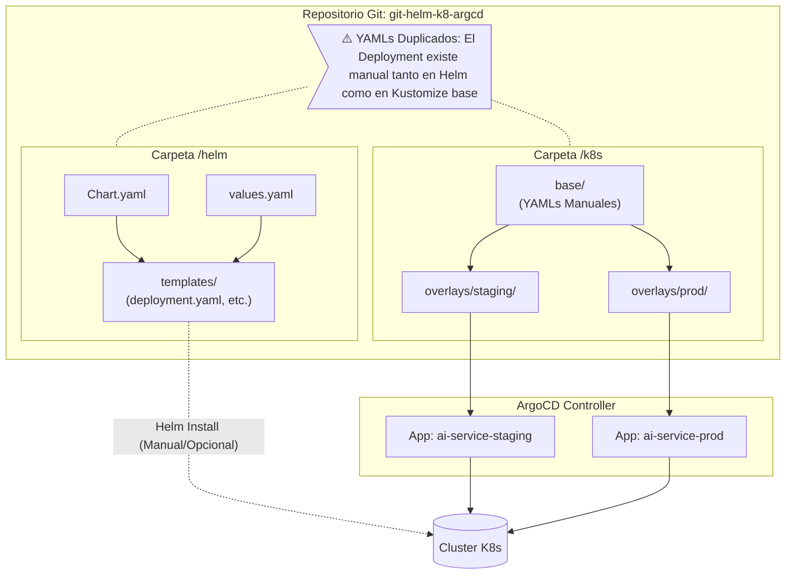
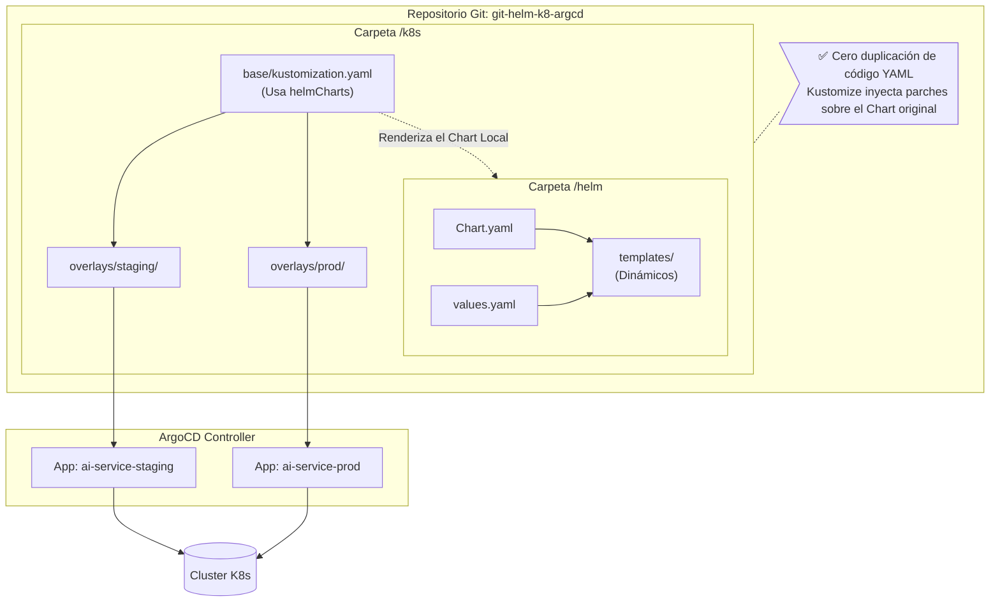

# Arquitectura GitOps: Estado Actual vs Futuro

A continuación se detallan los dos enfoques de uso de **Helm** y **Kustomize** junto con **ArgoCD**, utilizando diagramas para visualizar cómo interactúan las herramientas.

## Opción 1: Estado Actual (Independientes)

En esta configuración, Helm y Kustomize existen en paralelo. Cada uno tiene su propia copia de los archivos YAML básicos (`Deployment`, `Service`). ArgoCD está configurado para leer directamente de las carpetas de Kustomize (`overlays/`), mientras que Helm queda disponible para un uso manual o como alternativa completa.

***

## Opción 2: Estado Futuro Recomendado (Integrados)

En esta arquitectura, Kustomize **consume** el Chart de Helm de manera local mediante el nodo `helmCharts` de su `kustomization.yaml`. De esta manera, Helm se encarga de estandarizar la base y Kustomize se limita a inyectar parches (etiquetas, recursos, réplicas) para cada entorno específico (`staging` y `prod`). ArgoCD sigue escuchando de los `overlays/`.

### Ventajas del Estado Futuro
- **Mantenibilidad**: Si necesitas agregar una nueva variable de entorno genérica al Deployment, solo editas `helm/ai-service/templates/deployment.yaml` y la propaga a todos los overlays.
- **Limpieza**: Te evitas usar condicionales engorrosos de `if/else` típicos de Helm a la hora de personalizar para entornos específicos; de eso se ocuparán los parches de Kustomize de forma declarativa.
